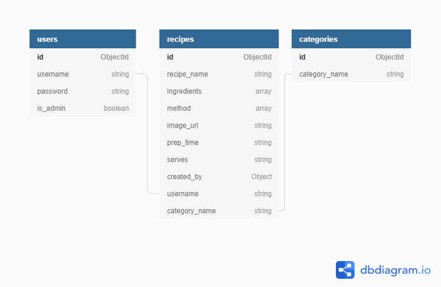

# RecipePod

View the live site [here]()

This is a site built for people who want to share their favorite recipes with others. It is a simple, easy to use, and free to use site. It is designed to be responsive on a wide range of devices.

*Image of the site*

## Table of Contents

1. [**UX**](#ux)

   - [**Project Goals**](#project-goals)
   - [**User Stories**](#user-stories)
   - [**Developers goals**](#developer-goals)  
   - [**Design**](#design)
   - [**Wireframes**](#wireframes)

2. [**Technologies Used**](#technologies-used)

3. [**Features**](#features)

   - [**Existing Features**](#existing-features)
   - [**Features to Implement**](#Features-to-Implement)

4. [**Testing**](#testing)

5. [**Deployment**](#deployment)

6. [**Credits**](#credits)
   - [**Content**](#content)
   - [**Media**](#media)
   - [**Code**](#code)
     - [**Educational Credit**](#educational-credit)
   - [**Acknowledgements**](#acknowledgements)

## UX

#### Project Goals

The goal of this project is to create a website for users to create, share, and edit their favorite food and beverage recipes.

#### User Stories

**First time users goals:**

As a first time user I want to be able to:

- Easily navigate the homepage.
- See the list of recipes.
- Search for recipes.
- Browse through recipes.
- Register to create a new account.

**Returning users goals:**

As a registered user I want to be able to:

- Login to access the account.
- Create a new recipe.
- Edit a recipe.
- Delete a recipe.
- Search for recipes.
- Navigate intuitively through the website.
- Get visual feedback on the website when an action is completed or fails.

**Administrators goals:**

In addition to the above user goals, I want to be able to:

- Edit any recipe.
- Delete any recipe.
- Create a new category.
- Delete a category.

#### Developer Goals

This developers goals:

- Are to demonstrate his ability to create a website using multiple technologies and applying full **CRUD**(_Create, Read, Update and Delete_) functionality.

## Design

### Color choice

- The colors chosen were:
	

		
	

	- The colors were chosen to be consistent with the color scheme of the [**Material Design**](https://material.io/guidelines/style/color.html)

	- The vivid orange stands out against the light blue background when paired together. These two primary colors are used to give the site a fresh and vibrant feel to help the recipes seem more appealing.

### Typography

### Images

### Database 

MongoDB is used to store the data for this website. The data has been set in 3 collections which can be seen in the image below.

####

### Wireframes

The wireframes were created using [Balsamiq](https://balsamiq.com/) during the design process of this project.

- Wireframes for this project can be found [**here**](static/docs/wireframes.pdf)

## Features

### Existing Features

### Features to Implement

## Technologies Used

- This project used HTML5, CSS3 and JavaScript.
- [jQuery](https://jquery.com/)
  - Used in this project to simplify manipulation of the DOM.
- [BootStrap](https://getbootstrap.com/docs/4.6/getting-started/introduction/)
  - Used to simplify the structure of this project and assist in responsiveness.
- [FontAwesome](https://fontawesome.com/)
  -Used in this project to place icons on the mute button.
- [Google Fonts](https://fonts.google.com/)
  - Used in this project to style the text.
- [VScode](https://code.visualstudio.com/)
  - This developer used VScode as the IDE to build the game.
  - **Prettier** extension used to help with formatting code.
  - **Spell Right** was used to assist with spell checking.
- [GitHub](https://github.com/)
  - This project used GitHub to store project code.

## Testing

All testing of this project can be found [**here**](testing.md) on a separate file.

## Deployment

This project was developed using [VScode](https://code.visualstudio.com/), committed to [Git](https://git-scm.com/) and pushed to [GitHub](https://github.com/).

### Requirements for deployment
- A GitHub account.
- A Heroku account.
- Knowledge of the Python programming language.
- A MongoDB account and database.

### Deploy on Heroku

- Login to [Heroku](https://www.heroku.com/).
- Click on "New" and select "Create new app"
- Enter the name of the app and click "Create".
- Select the region nearest to you.
- Click on the Connect to GitHub button.
- Search for the name of the repository.
- Click on the repository and select "Add to app".
- Go to the settings and click on Config Vars.
- Enter the variables in your env.py file in the text boxes.
- Enable the automatic deployment
- Click on "Deploy" and select "Deploy to Heroku".
- The app will be deployed to Heroku.

### How to clone this repository

- Login to [GitHub](https://github.com/)
- Fork this repository.
- Click on **code** under Settings button.
- choose HTTPS,SSH or GitHub CLI, then click the copy button.
- Open Git Bash and paste the link into the command line.
- Type **git clone** and press enter.
- The repository will be cloned to your computer.

## Credits

### Media

- The color palette used for this project can be found [**here**](https://www.shutterstock.com/blog/color-palettes-for-websites).

#### Images

### Code

- The secret key used in this project was generated using [Random key Gen](https://randomkeygen.com/)
- The code used for the navigation bar was created using [Materialize](https://materializecss.com/navbar.html) as a base template and then edited to fit the needs of this project.

#### Educational Credit

### Acknowledgements

### Content

- All text was written by Emmett Becirovic.
