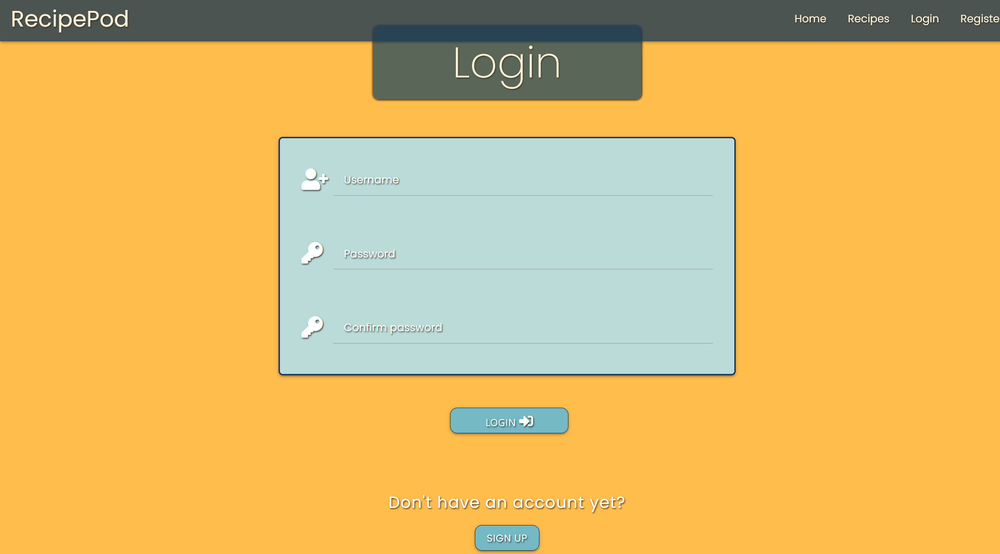
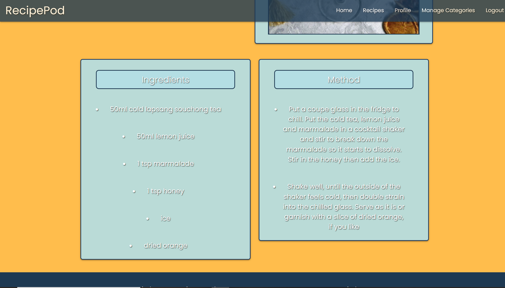
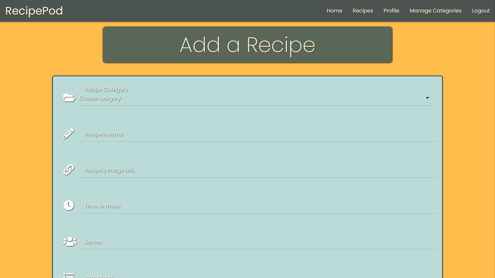

# RecipePod

View the live site [**here**](https://recipe-pod.herokuapp.com/)

This is a site built for people who want to share their favorite recipes with others. It is a simple, easy to use, and free to use site. It is designed to be responsive on a wide range of devices.

  	
  

## Table of Contents

1. [**UX**](#ux)

   - [**Project Goals**](#project-goals)
   - [**User Stories**](#user-stories)
   - [**Developers goals**](#developer-goals)
   - [**Design**](#design)
   - [**Wireframes**](#wireframes)

2. [**Technologies Used**](#technologies-used)

3. [**Features**](#features)

   - [**Existing Features**](#existing-features)
   - [**Features to Implement**](#Features-to-Implement)

4. [**Testing**](#testing)

5. [**Deployment**](#deployment)

6. [**Credits**](#credits)
   - [**Content**](#content)
   - [**Media**](#media)
   - [**Code**](#code)
     - [**Educational Credit**](#educational-credit)
   - [**Acknowledgements**](#acknowledgements)

## UX

#### Project Goals

The goal of this project is to create a website for users to create, share, and edit their favorite food and beverage recipes.

#### User Stories

**First time users goals:**

As a first time user I want to be able to:

- Easily navigate the homepage.
- See the list of recipes.
- Search for recipes.
- Browse through recipes.
- Register to create a new account.

**Returning users goals:**

As a registered user I want to be able to:

- Login to access the account.
- Create a new recipe.
- Edit a recipe.
- Delete a recipe.
- Search for recipes.
- Navigate intuitively through the website.
- Get visual feedback on the website when an action is completed or fails.

**Administrators goals:**

In addition to the above user goals, I want to be able to:

- Create a new category.
- Edit a category.
- Delete a category.

#### Developer Goals

This developers goals:

- Are to demonstrate his ability to create a website using multiple technologies and applying full **CRUD**(_Create, Read, Update and Delete_) functionality.

## Design

### Color choice

- The colors chosen were:
  

  	
  

  - The colors were chosen to be consistent with the color scheme of the [**Material Design**](https://material.io/guidelines/style/color.html)

  - The vivid orange stands out against the light blue background when paired together. These two primary colors are used to give the site a fresh and vibrant feel to help the recipes seem more appealing.

### Typography

- The primary font used is **Poppins** was chosen because it is easy to read, **Sans Serif** was used as a fallback font.

### Database

MongoDB is used to store the data for this website. The data has been set in 3 collections which can be seen in the image below.

#### Users Collection

- **users**: This collection stores the users information.
  - When user registers, the _username_, _password_ and a default value of **False** for _is_admin_ is stored here.

#### Recipes Collection

- **recipes**: This collection stores the recipes information.
  - When a recipe is created, the _recipe_name_, _category_name_, _ingredients_, _method_, _number of serves_, _image_URL and _created_by_ are stored here.

#### Categories Collection

- **categories**: This collection stores the categories information.
  - When a category is created, the _category_name_ and _created_by_ are stored here.

### Wireframes

The wireframes were created using [Balsamiq](https://balsamiq.com/) during the design process of this project.

- Wireframes for this project can be found [**here**](static/docs/wireframes.pdf)

## Features

### Existing Features

**The Homepage**

- A fixed navigation bar at the top of the page for ease of navigation and to give the user a quick overview of the website.

- A search bar in plain view of the page for ease of searching for recipes.

		

- Below the search bar is a CTA button to invite the user to register with the site.

- The **Footer** contains some social links to popular social media platforms. The footer also contains a copyright statement with the current year.

		

**The Registration page**

- The Registration page is a simple form that asks the user for their username and password.
- The user will enter their username of their choosing and the password will be hashed and stored in the database.
- A register button to submit the form. If the form is submitted successfully, the user will be redirected to the profile page.
- Below the register button is a CTA button to invite the user to login with the site.

		

**Login page**

- The Login page is very similar to the register form that asks the user for their username and password.
- The user will enter their username and password and if the credentials are valid, the user will be redirected to the profile page.
- Below the login button is a CTA button to invite the user to register with the site.

		

**Profile Page**

 - The profile page is a simple page that displays the user's username, and a list of their recipes they uploaded displayed as cards.
 - A button to navigate to the recipe creation page.
 - The user can click on a recipe card to view the full recipe details.
 - if the user has not created any recipes, there will be text displayed stating there's no recipes and asked to hit the button to be redirected to the recipe creation page.

		

		

**Full Recipe page**

- The full recipe page is a page that displays the recipe name, category, ingredients, method, number of serves, and an image of the recipe.
- A button to navigate to the recipe edit page if the user had created the recipe.
- A button to delete the recipe if the user had created the recipe.

		

		

**Recipes page**

 - The recipes page is a page that displays a list of recipes that have been created by any user created.

 - A search bar to search for recipes and a reset button to clear the search field.

 - A button to navigate to see the selected recipe.

 

		

**Add Recipe page**

 - The add recipe page is a page that displays a form to add a recipe.

- A form will be displayed with the following fields:
  - recipe name
  - category
  - ingredients
  - method
  - prep time
  - number of serves
  - image URL

 - Below both the ingredients and method fields is a button to add another ingredient or method.
 - After more that one method or ingredient is added, the user has the option to delete the extra ingredient or method.

 - At the bottom of the form is a button to submit the form and a button to cancel to clear the fields.

 

		

		

**Edit Recipe**

- The edit recipe page is a page that displays a form to edit a recipe.
**Note:** The user can only edit their own recipes.

 - A form will be displayed with the following fields:
  - recipe name
  - category
  - ingredients
  - method
  - prep time
  - number of serves
  - image URL

 - Below both the ingredients and method fields is a button to add another ingredient or method.

 - When one or more method or ingredient is entered, the user has the option to delete the extra ingredient or method.

 - At the bottom of the form is a button to submit the form and a button to cancel to reset the fields.

 

		

		

**Delete a Recipe**

 - Allows the user to delete a recipe they have created.

  - A modal will be displayed with a message that the recipe will be deleted.
  - A button to confirm the delete.
  - A button to cancel the delete and close the modal.

  

		

**Manage Categories**
- If the user have admin permissions, they will be able to manage categories.
- The user has the ability to add, edit, and delete categories.
- The user has the ability to see a list of all categories.
- There is be a button to add a new category.

		

**Add a Category**

- The add category page is a page that displays a form to add a category.

 - A form will be displayed with the following fields:
  - category name

 - At the bottom of the form is a button to submit the form and a button to cancel to clear the fields.

		

**Edit a Category**

 - The edit category page is a page that displays a form to edit a category.

 - A form will be displayed with the following fields:
  - category name

 - At the bottom of the form is a button to submit the form and a button to cancel to redirect to manage categories.

 

		

**Delete a Category**

 - Allows the user to delete a category they have created.

  - A modal will be displayed with a message that the category will be deleted.
  - A button to confirm the delete.
  - A button to cancel the delete and close the modal.

		

### Features to Implement

- [x] Ability to delete a user.
- [x] Connect users to an email API to send newsletters.

## Technologies Used

- This project used HTML5, CSS3 and JavaScript.
- [jQuery](https://jquery.com/)
  - Used in this project to simplify manipulation of the DOM.
- [Materialize](https://materializecss.com/)
  - Used to simplify the structure of this project and assist in responsiveness.
- [FontAwesome](https://fontawesome.com/)
  -Used in this project to place icons on the mute button.
- [Google Fonts](https://fonts.google.com/)
  - Used in this project to style the text.
- [VScode](https://code.visualstudio.com/)
  - This developer used VScode as the IDE to build the game.
  - **Prettier** extension used to help with formatting code.
  - **Spell Right** was used to assist with spell checking.
- [GitHub](https://github.com/)
  - This project used GitHub to store project code.
- [Am I Responsive](http://ami.responsivedesign.is/#)
	- Was used in this project to check responsive design and create the image located at the top of this file.
- [Flask](https://flask.palletsprojects.com/en/2.0.x/)
	- This project used Flask to host the web app.
- [Flask-PyMongo](https://flask-pymongo.readthedocs.io/en/latest/)
	- This project used Flask-PyMongo to connect to MongoDB.
- [BSON](https://docs.mongodb.com/manual/reference/bson-types/)
	- This project used BSON to store data in MongoDB.
- [MongoDB](https://www.mongodb.com/)
	- This project used MongoDB to store data.
- [Jinja](https://jinja.palletsprojects.com/)
	- This project used Jinja to render the HTML.
- [Werkzeug](http://werkzeug.palletsprojects.com/)
	- This project used Werkzeug to create the web app security.

## Testing

All testing of this project can be found [**here**](testing.md) on a separate file.

## Deployment

This project was developed using [VScode](https://code.visualstudio.com/), committed to [Git](https://git-scm.com/) and pushed to [GitHub](https://github.com/).

### Requirements for deployment

- A GitHub account.
- A Heroku account.
- Knowledge of the Python programming language.
- A MongoDB account and database.

### Deploy on Heroku

- Login to [Heroku](https://www.heroku.com/).
- Click on "New" and select "Create new app"
- Enter the name of the app and click "Create".
- Select the region nearest to you.
- Click on the Connect to GitHub button.
- Search for the name of the repository.
- Click on the repository and select "Add to app".
- Go to the settings and click on Config Vars.
- Enter the variables in your env.py file in the text boxes.
- Enable the automatic deployment
- Click on "Deploy" and select "Deploy to Heroku".
- The app will be deployed to Heroku.

### How to clone this repository

- Login to [GitHub](https://github.com/)
- Fork this repository.
- Click on **code** under Settings button.
- choose HTTPS,SSH or GitHub CLI, then click the copy button.
- Open Git Bash and paste the link into the command line.
- Type **git clone** and press enter.
- The repository will be cloned to your computer.

## Credits

### Media

- [Jamie Oliver](https://www.jamieoliver.com/) for using their sample recipes.

- [BBCGoodFood](https://www.bbcgoodfood.com/) for using their sample recipes.

- The color palette used for this project can be found [**here**](https://www.shutterstock.com/blog/color-palettes-for-websites).

#### Images

- The Hero image for this project can be found [**here**](https://unsplash.com/photos/rD3YrnhTmf0) and was created by Ella Olsson.

### Code

- The secret key used in this project was generated using [Random key Gen](https://randomkeygen.com/).

- The code used for the navigation bar was created using [Materialize](https://materializecss.com/navbar.html) as a base template and then edited to fit the needs of this project.

- The code used to template the registration form both in the **app.py** and **register.html** was based around Code Institute's [Task Manager project](https://www.youtube.com/watch?v=Sfkg3358Igc) and modified to this projects needs.

- The code used to inject the current datetime in to the templates was based on [**this**](https://stackoverflow.com/questions/41231290/how-to-display-current-year-in-flask-template) answered by [Davidism](https://stackoverflow.com/users/400617/davidism).

- The code used to fade out the flash messages after 3 seconds was based on [**This**](https://stackoverflow.com/questions/31176402/how-to-hide-flash-message-after-few-seconds) answered by [Puja](https://stackoverflow.com/users/4985643/puja).

- The code used to prevent the default click event from firing when the user clicks on the add ingredient or add method button was found [**here**](https://api.jquery.com/event.preventDefault/).

- The code used to validate the login and register form was found [**here**](https://www.aspsnippets.com/Articles/Password-and-Confirm-Password-validation-using-JavaScript-and-jQuery.aspx).

#### Educational Credit

- Code Institute's [Task Manager project](https://www.youtube.com/watch?v=Sfkg3358Igc) was used to help guide me through this project and help me understand how to create a web app.

### Acknowledgements

- The team at [Code Institute](https://www.codecademy.com/) for their support and help in this project.

- [Slack](https://slack.com/) for their support and help in this project.

## For the Assessor
When the CI Assessor would like to sign in to the web app as admin, They can do so with the following username and password.

   - Username: bozy
   - Password: testingms3

### Content

- All text was written by Emmett Becirovic.
