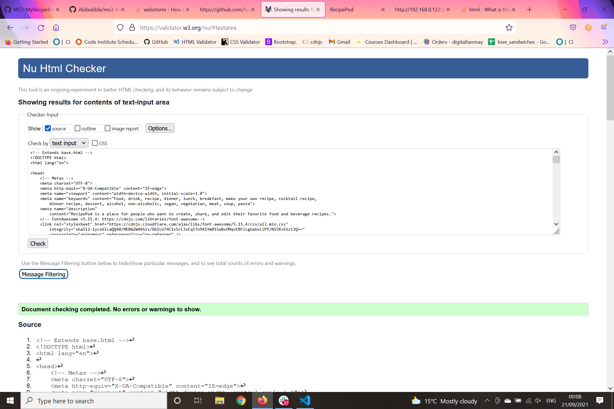

# RecipePod - Testing section

[Main README.md file for RecipePod](README.md)

## Table of Contents

1. [**Manual Tests**](#manual-testing)
2. [**Client Stories Tests**](#client-stories-tests)
3. [**Automated Tests**](#automated-tests)
4. [**Bugs**](#bugs)
   - [**Solved Bugs**](#solved-bugs)
   - [**Unsolved Bugs**](#unsolved-bugs)

## Manual Tests

### Tests on Laptop

**All tests on laptop were repeated in Chrome and Firefox on two different screen sizes.**

#### Testing Navigations

**If the user is not logged in**

- [x] When you open the app, you should see the main page.
- [x] Click on the "Home" button. You should see the home page.
- [x] Click on the "Recipes" button. You should see the recipes page.
- [x] Click on the "Register" button. You should see the register page.
- [x] Click on the "Login" button. You should see the login page.

**If the user is logged in**

- [x] When you open the app, you should see the main page.
- [x] Click on the "Home" button. You should see the home page.
- [x] Click on the "Recipes" button. You should
      see the recipes page.
- [x] Click on the "Profile" button. You should see the profile page.
- [x] Click on the "Logout" button. You should see the login page.

**If the user has admin permissions**

- [x] When you open the app, you should see the main page.
- [x] Click on the "Home" button. You should see the home page.
- [x] Click on the "Recipes" button. You should see the recipes page.
- [x] Click on the "Profile" button. You should see the profile page.
- [x] Click on the "Manage Categories" button. You should see the manage categories page.
- [x] Click on the "Logout" button. You should see the login page.

#### Testing Buttons

- [x] Click on the Register button. You should see the register page. *Only if user isn't logged in*
- [x] Click on the Login button. You should see the login page. *Only if user isn't logged in*
- [x] Click on the Logout button. You should logout. *Only if user is logged in*
- [x] Click on the "Add Recipe" button. You should see the add recipe page. *Only if user is logged in*
- [x] Click on the "Add Category" button. You should see the add category page. *Only if user is admin*
- [x] Click on the "Manage Categories" button. You should see the manage categories page. *Only if user is admin*
- [x] Click on the "Profile" button. You should see the profile page. *Only if user is logged in*
- [x] Click on the "Reset Button" button. it should should refresh the page or redirect back to the previous page.
- [x] Click on  the "See full recipe" button. You should see the full recipe page.
- [x] Click on the "Edit Recipe" button. You should see the edit recipe page.
- [x] Click on the "Delete Recipe" button. You should see a modal pop up and ask to confirm deletion.
- [x] Click on the "Delete Category" button. You should see a modal pop up and ask to confirm deletion.
- [x] Click on the "Edit Category" button. You should see the edit category page.

#### Testing Forms

**Register Form**
- [x] If the user tries to register without entering a username, the form should not be submitted.
- [x] If the user tries to register without entering a password, the form should not be submitted.
- [x] If the user tries to register without entering a password confirmation, the form should not be submitted.
- [x] If the user tries to register with a password confirmation that doesn't match the password, the form should not be submitted.

**Login Form**
- [x] If the user tries to login without entering a username, the form should not be submitted.
- [x] If the user tries to login without entering a password, the form should not be submitted.
- [x] If the user tries to login with a password that doesn't match the password, the form should not be submitted.
- [x] If the user tries to login with a username that doesn't exist, the form should not be submitted.

### Tests on Mobiles and tablets

**All tests were performed on this developers Xiaomi mi 10 mobile device and iPad. All tests done on Laptop were performed on the mobile devices.**

## Client Stories Tests

#### As a user, I want:
- **to be able to navigate easily between the different pages of the app**
    - [x] The fixed navigation bar is clearly visible on all the pages and has the correct links.

- **See the list of recipes**
    - [x] I can see the list of recipes on the recipe page and also via the search bar.

- **See the details of a recipe**
    - [x] I can see the details of a recipe on the full recipe page.

- **Search for recipes**
    - [x] I can search for recipes by name, ingredients, and who created them.

- **Register to create a new account**
    - [x] I can register to create a new account on the register page.

#### As a registered user, I want:
- **to be able to login to my account**
    - [x] I can login to my account on the login page.

- **to be able to logout of my account**
    - [x] I can logout of my account with the logout button.

- **Be able too create a new recipe**
    - [x] I can create a new recipe on the add recipe page.

- **Be able to edit my own recipes**
    - [x] I can edit my own recipes on the edit recipe page.

- **Be able to delete my own recipes**
    - [x] I can delete my own recipes with the delete button.

#### As an admin, I want:
- **to be able to manage categories of recipes**
    - [x] I can manage categories of recipes on the manage categories page.
    - [x] I can add a new category on the add category page.
    - [x] I can edit a category on the edit category page.
    - [x] I can delete a category on the delete category page.

## Automated Tests

These were the validation services use to check the projects code.

- [W3C Markup Validation](https://validator.w3.org/) was used to check the HTML.
- [W3C CSS Validation](https://jigsaw.w3.org/css-validator/) was used to check the CSS.
- [JSHint](https://jshint.com/) was used to check the JavaScript.
- [PEP8](https://www.python.org/dev/peps/pep-0008/) was used to check the Python.
- [Google Lighthouse](https://developers.google.com/web/tools/lighthouse/) was used to check the performance.

  

## Bugs

#### Solved Bugs

#### **Bug 1**

- Description: **The user can't see the recipe's category name when on the recipe page**

* Fix: In the app.py file, within the the add_recipe view, the category_name key was incorrectly set to category.

    

    
    

* This was easily fixed by changing the category key to category_name.

    

    
    

* Test: The user can now see the recipe's category name when on the recipe page.

    

    
    

#### **Bug 2**

- Description: **The navbar was being covered by the page content**

    

    
    

* Fix: The bug was resolved by adding a z-index of 5 to ensure there would be no overlap.

    

    
    

* Test: The navbar is no longer covered by the page content.

    

    
    

#### **Bug 3**

- Description: **The User Can't see their recipes they uploaded on their profile**

    

    
    

* Fix: The bug was resolved by changing `{"created_by": session["user"].capitalize()}` to `{"created_by": session["user"].lower()}`

  - This was done because the session["user"] was being set to the capitalized version of the user's name. This was causing the user's name to be read incorrectly which made the code think the user hadn't created any recipes.

* Test: The user can now see their recipes they uploaded on their profile.

    

    
    

#### **Bug 4**

- Description: **The delete category button would only delete the first category and not the selected category**

* Fix: The section of code uses a for loop to iterate through the categories and a modal that pops up when the user clicks the delete button to ask the user if they want to delete the category. The for loop was duplicating the objectID of the categories and was causing the bug. I resolved the bug by adding the objectID to the anchor and modal ID.

* Test: The user can now delete the category they selected.

#### **Bug 5**

- Description: **When the user edits a category the edited category is there but so is the old category**

* Fix: the issue was I had copied the `add_category.html` file as a template for the `edit_category.html` file. This caused the bug because the action in the form tag was directing to `{{ url_for('add_category') }}` when it should have directed to `{{ url_for('edit_category') }}`. I resolved the bug by changing the action to `{{ url_for('edit_category') }}`.

* Test: The user can now edit the category they selected and it is updated in the database.

#### Unsolved Bugs

No noticed unresolved bugs during testing on all devices.
